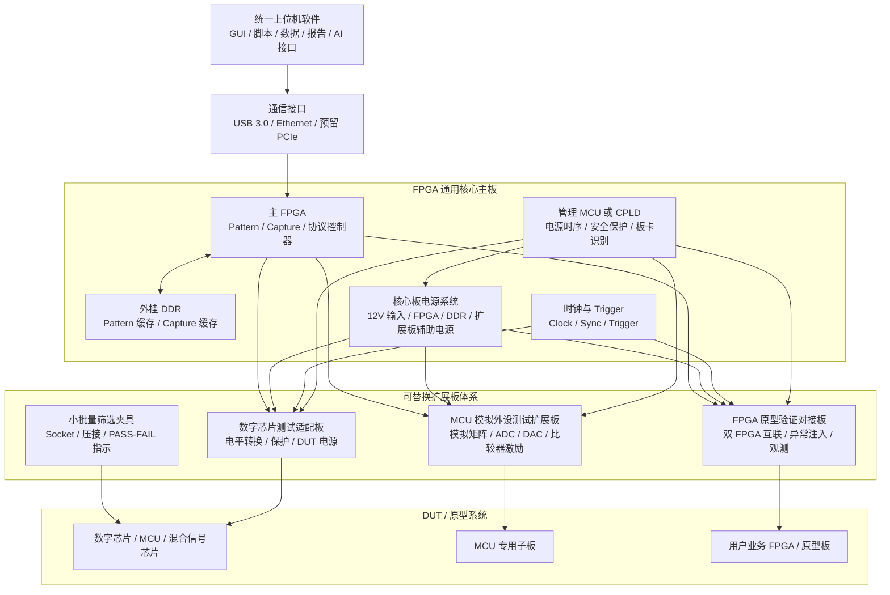

# 总体系统架构

## 章节定位

本章定义整个平台的系统级架构，回答几个核心问题：

- 平台由哪些层组成
- 上位机、核心 FPGA 主板、扩展板、DUT 之间如何分工
- 测试数据、控制命令、电源状态、采样结果如何流转
- 通用芯片测试模式和流片前 FPGA 原型验证模式如何共用同一套底座
- 后续 AI 自动化、数据闭环和回归测试如何接入

总体目标是把平台设计成：

```text
硬件可复用
资源可抽象
流程可脚本化
数据可沉淀
问题可复现
测试可闭环
```

## 总体架构原则

### 1. 分层解耦

平台按四层设计：

```text
上位机软件层
  ↓
核心 FPGA 主板层
  ↓
扩展板 / 适配母板层
  ↓
DUT 子板 / 夹具 / 原型系统层
```

各层职责清晰：

| 层级 | 主要职责 | 变化频率 |
|---|---|---:|
| 上位机软件层 | 配置、脚本、执行、数据、报告、AI 接口 | 持续迭代 |
| 核心 FPGA 主板层 | Pattern、Capture、DDR、Trigger、协议控制器、通信、电源管理 | 低频变化 |
| 扩展板 / 适配母板层 | 电平转换、DUT 电源、保护、模拟前端、收发器、场景适配 | 中频变化 |
| DUT 子板 / 夹具层 | 封装适配、Socket、探针、引脚扇出、项目定制 | 高频变化 |

核心原则：

> 核心板尽量稳定，扩展板承接场景变化，DUT 子板承接封装变化，上位机承接流程和数据变化。

### 2. 资源抽象统一

无论测试的是数字芯片、MCU、混合信号芯片，还是流片前 FPGA 原型系统，上位机看到的都应该是统一资源模型。

平台资源可抽象为：

- 数字 IO 资源
- Pattern 资源
- Capture 资源
- 协议控制器资源
- 电源资源
- 时钟资源
- Trigger / Sync 资源
- 模拟激励 / 采样资源
- 扩展板资源
- DUT 配置资源

这样后续测试脚本不直接关心具体 FPGA 引脚，而是调用资源名：

```text
dut_vdd
bank_a[0..31]
spi0
trigger_in0
capture_group0
adc_input_ch1
```

### 3. 控制、数据、安全三条链路分开设计

系统架构上至少要区分三类链路：

```text
控制链路：上位机 → 核心板 → 扩展板 → DUT
数据链路：DUT / FPGA → Capture / DDR → 上位机 → 数据库 / 报告
安全链路：电源监控 / FAULT / 温度 / 过流 → 管理 MCU/CPLD → 硬件关断
```

其中安全链路不能完全依赖上位机软件，必须有硬件或底层固件兜底。

## 系统总体框图



## 硬件层级设计

### 1. 上位机软件层

上位机是平台的大脑，负责把硬件资源组织成可执行测试流程。

主要职责：

- 识别核心板和扩展板
- 加载 DUT 配置文件
- 配置 IO、电源、时钟、Trigger、Pattern、Capture
- 下载 Pattern 或测试任务
- 执行测试脚本
- 实时读取状态和日志
- 回读 Capture 数据
- 自动判定 PASS/FAIL
- 生成报告
- 保存测试数据
- 为 AI Agent 提供上下文和操作接口

### 2. 核心 FPGA 主板层

核心板是长期复用的数字验证底座。

核心能力：

- 多通道数字 Pattern 输出
- 输入采样与响应比较
- Fail Capture
- DDR 长向量缓存
- 协议硬件控制器：SPI/I2C/UART/GPIO/PWM 等
- Trigger In/Out
- Clock Output / Clock Input
- 扩展板接口
- 上行通信
- 板载管理与安全保护

核心板不直接追求覆盖所有 DUT 特殊需求，而是提供稳定、可复用、可扩展的通用资源池。

### 3. 扩展板 / 适配母板层

扩展板定义具体测试场景。

主要职责：

- DUT 电源生成
- 电平转换
- ESD/过压/反灌保护
- 模拟前端
- 专用收发器
- Socket / 插座接口
- 扩展板 ID / EEPROM
- 板温、电压、电流监控
- 引脚映射
- 防呆与安全互锁

扩展板通过统一接口接入核心板，但允许按数字芯片、MCU 模拟外设、FPGA 原型验证、小批量筛选等方向分化。

### 4. DUT 子板 / 夹具 / 原型系统层

这一层承接具体项目变化。

包括：

- QFN/QFP/SOP/BGA 封装子板
- Socket 板
- 探针夹具
- 压接治具
- 用户 FPGA 原型板
- 客户现场复现接口板

这一层应该尽量低成本、快速迭代，避免每个 DUT 都重新设计核心能力。

## 系统数据流

平台典型数据流如下：

```text
测试需求 / 用例
  ↓
上位机测试脚本
  ↓
资源映射与安全检查
  ↓
Pattern / 协议命令 / 电源配置下发
  ↓
核心 FPGA 执行
  ↓
DUT 响应 / 状态 / 波形采集
  ↓
Capture / DDR 缓存
  ↓
上位机回读
  ↓
自动判定 PASS/FAIL
  ↓
日志、波形、寄存器、报告入库
  ↓
回归分析 / AI 分析 / 补充测试
```

### Pattern 数据流

```text
上位机生成 Pattern
  ↓
Pattern 编译或格式化
  ↓
通过 USB/Ethernet 下发到核心板
  ↓
写入 DDR 或 FPGA 内部缓存
  ↓
Pattern 引擎按 Trigger 执行
  ↓
DUT 响应被 Capture 引擎采集
  ↓
失败窗口保存在 DDR
  ↓
上位机回读分析
```

### 协议数据流

常规协议通信不一定全部走 Pattern。

推荐分工：

```text
正常寄存器读写、配置、状态查询：SPI/I2C/UART 硬件控制器
异常时序、缺 ACK、毛刺、边界破坏：Pattern 引擎
```

这样既能保证常规测试效率，也能覆盖异常和鲁棒性测试。

### Capture 数据流

Capture 数据主要包括：

- IO 采样波形
- 协议交易日志
- 失败窗口
- Trigger 前后数据
- DUT 状态引脚
- 电源异常事件
- 寄存器 dump

这些数据要能和测试脚本版本、DUT 编号、扩展板版本、时间戳绑定，便于后续复现和回归。

## 系统控制流

典型测试控制流：

```text
连接核心板
  ↓
识别核心板型号和固件版本
  ↓
识别扩展板 ID 和硬件版本
  ↓
加载扩展板配置文件
  ↓
加载 DUT 配置文件
  ↓
检查 IO 映射、电压域、电流限值、安全默认态
  ↓
核心板电源稳定
  ↓
扩展板辅助电源开启
  ↓
DUT 电源按顺序开启
  ↓
释放 Reset / 配置 Boot Mode
  ↓
下载 Pattern 或初始化协议控制器
  ↓
执行测试脚本
  ↓
采集结果并判定
  ↓
异常则关断 DUT 电源并保存现场
  ↓
生成报告
```

### 安全优先的控制原则

控制流中必须坚持：

- 未识别扩展板，不允许 DUT 上电
- 未加载 DUT 配置，不允许驱动 IO
- 电平转换 OE 默认关闭
- FPGA IO 默认高阻
- DUT 电源默认关闭
- 过流/过压/过温时优先硬件关断
- 软件脚本不能绕过底层安全互锁

## 两种工作模式

### 1. 通用芯片测试模式

### 目标

面向流片后芯片样品、MCU、数字芯片、混合信号芯片、接口芯片等 DUT。

上位机配置测试脚本，核心板输出电源控制、时钟、数字激励和协议命令，扩展板完成 DUT 适配，平台采集 DUT 输出并自动判定 PASS/FAIL。

### 典型流程

```text
插入 DUT / 子板
  ↓
识别扩展板和 DUT 配置
  ↓
DUT 上电
  ↓
基础连通性检查
  ↓
寄存器读写 / Boot 检查
  ↓
功能 Pattern 测试
  ↓
协议测试
  ↓
异常测试
  ↓
Capture 失败现场
  ↓
生成测试报告
```

### 适合场景

- 芯片样品 bring-up
- 数字功能验证
- MCU 外设自动化测试
- 接口协议验证
- 失败复现
- 回归测试
- 小批量样品筛选

### 2. 流片前 FPGA 原型验证模式

### 目标

面向流片前 FPGA 原型系统，核心板作为用户业务 FPGA 的外部可控环境，提供协议交互、异常激励、信号观测和自动化回归。

这让平台不只在流片后使用，也能提前进入芯片设计和 FPGA 原型验证阶段。

### 典型流程

```text
连接用户业务 FPGA / 原型板
  ↓
同步时钟和 Reset
  ↓
加载协议仿真或 Pattern
  ↓
对业务 FPGA 注入正常输入
  ↓
执行异常输入 / 边界时序 / 毛刺 / 超时测试
  ↓
Capture 关键总线和状态信号
  ↓
自动对比预期行为
  ↓
生成回归结果
```

### 适合场景

- 流片前 FPGA 原型对拖验证
- 协议外设仿真
- 异常输入注入
- 设计边界条件测试
- 长时间稳定性回归
- 流片后问题在 FPGA 原型侧复现

### 3. 两种模式的共用能力

两种模式不是两套平台，而是共用同一套底座。

| 能力 | 通用芯片测试模式 | FPGA 原型验证模式 |
|---|---|---|
| Pattern 输出 | 用于 DUT 激励 | 用于原型输入激励 |
| Capture | 采集 DUT 响应 | 采集业务 FPGA 状态 |
| 协议控制器 | 配置 DUT 寄存器 | 模拟外设或主机接口 |
| Trigger/Sync | 同步测试和外部仪器 | 同步多 FPGA / 原型系统 |
| DDR | 长 Pattern 和失败窗口 | 长时间回归和事件缓存 |
| 上位机脚本 | 芯片测试流程 | 原型验证流程 |
| 数据报告 | PASS/FAIL 和波形 | 回归结果和异常分析 |

## 平台资源抽象

### 数字 IO 资源

数字 IO 是平台最核心资源，需要统一命名、分组和映射。

示例：

```text
io.bank_a.ch0
io.bank_a.ch1
io.bank_b.ch0
trigger.out0
clock.out0
reset.dut
```

每个 IO 资源至少应包含：

- 物理 FPGA 引脚
- 所属 Bank
- 电压域
- 是否支持输入/输出/三态
- 是否支持 Pattern
- 是否支持 Capture
- 扩展板映射
- DUT 引脚映射
- 默认安全态

### 电源资源

电源资源应统一抽象为可配置对象。

示例：

```text
power.dut_vdd
power.iovdd
power.avdd
power.ext_5v
```

每个电源资源至少包含：

- 电压范围
- 默认电压
- 电流限制
- 上电顺序
- PGOOD 状态
- FAULT 状态
- 电压/电流回读
- 过流关断策略

### 时钟与 Trigger 资源

时钟和触发资源负责同步测试过程。

示例：

```text
clock.pattern_base
clock.dut_ref
trigger.in0
trigger.out0
sync.bus0
```

需要支持：

- 输出频率配置
- 外部参考输入
- Trigger 边沿选择
- 触发延时
- Capture 前后窗口
- 多板同步预留

### 协议资源

协议资源面向常规通信和寄存器读写。

示例：

```text
spi0
i2c0
uart0
pwm0
```

协议资源应能和 Pattern 资源切换或组合：

```text
SPI 正常写寄存器 → Pattern 注入异常边沿 → Capture 观察响应
```

### 模拟资源

模拟资源主要由扩展板提供，上位机统一抽象。

示例：

```text
analog.dac0
analog.adc0
analog.switch_matrix.ch3
analog.current.dut_vdd
```

第一版模拟资源以功能验证为主，不定位高精度参数测试。

## 配置文件体系

为了实现自动化和多扩展板复用，需要建立配置文件体系。

建议分为：

```text
core_board.yaml       核心板资源定义
extension_board.yaml  扩展板能力和映射
DUT.yaml              DUT 引脚、电源、测试模式定义
test_plan.yaml        测试流程定义
```

### 核心板配置

描述核心板固定资源：

- FPGA 型号
- 固件版本
- IO Bank
- Pattern 通道
- Capture 通道
- DDR 容量
- 通信接口
- Trigger/Clock 资源

### 扩展板配置

描述扩展板能力：

- 扩展板 ID
- 硬件版本
- 支持场景
- IO 映射
- 电源通道
- 模拟通道
- 保护策略
- 校准数据

### DUT 配置

描述具体待测芯片：

- DUT 型号
- 封装
- 引脚表
- 电源需求
- Boot 模式
- Reset 流程
- 通信接口
- 默认测试模板

### 测试计划配置

描述测试流程：

- 上电步骤
- 初始化步骤
- Pattern 文件
- 协议命令
- 判定条件
- Capture 条件
- 报告字段

## 与外部仪器的关系

平台不是替代所有仪器，而是把测试流程自动化和数据闭环化。

外部仪器仍然可以作为辅助：

- 示波器：观察高速波形、电源纹波、异常边沿
- 逻辑分析仪：辅助调试复杂协议
- 万用表 / 源表：高精度电压电流确认
- 频谱仪 / 抖动仪：专业时钟和高速信号测试
- 温箱：温度条件测试

平台需要预留 Trigger Out、Sync、日志时间戳和测试点，让外部仪器可以被纳入测试流程。

## AI 自动化闭环接口

从系统架构上，平台要为 AI 自动化留接口。

AI 不直接绕过安全机制控制硬件，而是通过上位机暴露的受控 API 操作资源。

AI 可参与：

- 根据 DUT 文档生成测试计划
- 根据寄存器表生成读写用例
- 根据失败日志分析可能原因
- 根据 Capture 波形总结异常模式
- 根据回归结果推荐补充测试
- 自动生成客户报告或内部验证报告

闭环路径：

```text
DUT 文档 / 寄存器表 / 需求
  ↓
AI 生成测试计划
  ↓
上位机安全校验
  ↓
平台执行测试
  ↓
数据和日志回传
  ↓
AI 分析失败原因
  ↓
生成补充测试
  ↓
进入回归测试库
```

这也是平台区别于单块 FPGA 测试板的重要价值。

## 第一版系统边界

第一版系统不追求一步到位。

### 第一版重点实现

- 核心板基础通信
- 扩展板识别
- DUT 电源安全控制
- 160 路左右数字 IO 闭环验证
- 基础 Pattern 输出
- 基础 Capture
- SPI/I2C/UART/GPIO 等常用协议控制
- 简单测试脚本执行
- 基础报告生成
- 数字测试扩展板闭环
- MCU 简化模拟外设扩展板验证
- FPGA 原型验证对接 Demo

### 第一版暂不主打

- 高精度模拟参数测试
- 高速 SerDes 一致性测试
- 专业抖动测试
- 量产 ATE 替代
- 全自动机械上下料
- 完整 AI 自主闭环
- 复杂多站并行测试

## 总结

总体系统架构可以概括为：

```text
上位机统一编排
核心板提供通用数字验证资源
扩展板承接场景能力
DUT 子板承接封装变化
数据链路支撑回归和 AI 分析
安全链路保证硬件和 DUT 不被误操作损坏
```

这套架构的核心优势不是某一个单点功能，而是把流片前 FPGA 原型验证、流片后 bring-up、研发功能验证、问题复现、回归测试、小批量筛选和客户现场支持连接成一条可复用的自动化验证链路。
