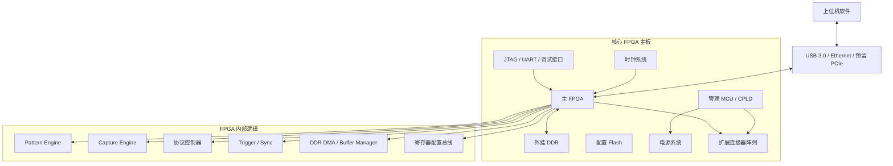

# 核心 FPGA 主板设计

## 主板定位

核心 FPGA 主板是整个平台长期复用的数字验证底座。

它的职责不是直接适配所有 DUT，而是提供稳定、可扩展、可脚本化的通用资源池：

```text
Pattern 发生
Capture 采样
DDR 缓存
协议控制
Trigger / Sync
扩展板互联
上位机通信
底层安全管理
```

核心板设计要避免两个极端：

- 过于简单：变成普通 FPGA 开发板，缺少测试平台能力
- 过于复杂：把所有模拟、高速、量产功能都塞进主板，导致成本和风险失控

推荐原则：

> 核心板做稳定通用资源，扩展板做场景适配，DUT 子板做封装适配。

## 设计目标

### 第一版目标

- 支持 160~192 路可用数字 IO
- 硬件规划预留 224~256 路可扩展 IO
- 支持外挂 DDR，用于 Pattern 缓存、Capture 缓存、Fail Capture、长向量回放
- 支持常用协议控制器：SPI、I2C、UART、GPIO、PWM
- 支持可配置 Pattern 输出和输入 Capture
- 支持 Trigger In/Out、Clock In/Out
- 支持扩展板 ID 识别和安全互锁
- 支持上位机高速通信
- 支持 DUT 电源控制和故障快速关断

### 长期目标

- 多板同步
- 更高通道数
- 更复杂 Pattern 编译
- 更强实时比较和失败定位
- 更丰富协议控制器
- 扩展板生态标准化
- 与 AI 自动化测试系统深度集成

## 核心板功能框图



## FPGA 选型原则

### 关键指标

选择 FPGA 时重点关注：

- 可用 IO 数量
- IO Bank 数量和电压灵活性
- 内部 BRAM / URAM 资源
- DDR 控制器支持
- PLL/MMCM 数量
- 逻辑资源规模
- 封装可制造性
- 成本和供货稳定性
- 开发工具成熟度
- 是否方便后续国产替代或多供应商方案

### 推荐档位

第一版不建议选太小的 FPGA。

原因：

- IO 规模已经按 BGA256 DUT 预留
- Pattern / Capture / 协议控制器会消耗逻辑资源
- DDR、DMA、上行通信、Trigger 也需要资源
- 后续一定会增加功能，低配 FPGA 很快不够用

建议选择中高档 FPGA，优先保证：

```text
IO 余量 > 逻辑余量 > DDR 能力 > 成本极限优化
```

### IO Bank 规划

IO Bank 不应只按数量堆叠，而要按用途分组：

| 分组 | 用途 | 说明 |
|---|---|---|
| DUT_IO_BANK_A/B/C/D | 主要数字测试 IO | 连接扩展板，支持 Pattern/Capture |
| CTRL_BANK | 管理、低速控制、板卡识别 | I2C/SPI/GPIO 等 |
| TRIG_CLK_BANK | Trigger、Sync、外部时钟 | 需要较好时序和布线 |
| COMM_BANK | USB/Ethernet/PCIe 辅助接口 | 根据通信方案确定 |
| DEBUG_BANK | JTAG/UART/调试 | 便于 bring-up |

## DDR / Pattern 存储

### 为什么需要外挂 DDR

外挂 DDR 是核心板能力上限的重要保证。

用途：

- 长 Pattern 缓存
- Capture 数据缓存
- Fail Capture 前后窗口
- 长时间回归事件缓存
- 大批量测试向量下载
- 多测试项结果暂存

如果没有 DDR，平台会受限于 FPGA 内部 BRAM，Pattern 长度和 Capture 深度都会很快遇到瓶颈。

### DDR 使用模型

建议把 DDR 逻辑抽象为几个 Buffer：

```text
pattern_buffer      测试向量区
capture_buffer      采样结果区
fail_window_buffer  失败窗口区
log_buffer          事件日志区
```

每个 Buffer 由上位机配置大小、起始地址和读写权限。

### 第一版建议

MVP 阶段不必一开始做复杂内存管理，但要预留结构：

- 支持上位机写入 Pattern
- 支持 FPGA 按地址顺序读取 Pattern
- 支持 Capture 写入 DDR
- 支持上位机回读指定区间
- 支持失败触发后冻结窗口

## Pattern 引擎

### 目标

Pattern 引擎负责按确定时序驱动多路数字 IO。

典型用途：

- 并行 IO 激励
- DUT 输入向量
- 边界时序测试
- Reset / Boot Mode 控制
- 协议异常注入
- 多信号同步动作

### 基础能力

第一版 Pattern 引擎建议支持：

- 多通道并行输出
- 每拍输出值和输出使能
- 输入/输出/高阻切换
- 可配置节拍频率
- Loop / Repeat
- Wait Trigger
- 条件停止
- 与 Capture 同步启动

### Pattern 数据格式建议

基础格式可抽象为：

```text
time_step
io_value[N-1:0]
io_oe[N-1:0]
compare_mask[N-1:0]
expected_value[N-1:0]
control_flags
```

后续可发展为更高级 Pattern 编译器，把 YAML/CSV/脚本编译为 FPGA 可执行格式。

## Capture 引擎

### 目标

Capture 引擎负责采集 DUT 响应和关键状态。

用途：

- 输入波形采样
- 协议响应记录
- 失败窗口保存
- Trigger 前后波形捕获
- 长时间事件记录

### 基础能力

第一版建议支持：

- 多通道同步采样
- 可配置采样时钟
- Trigger 前后窗口
- 采样掩码
- 实时比较 expected vs actual
- Fail 地址记录
- DDR 写入
- 上位机回读

### Fail Capture

Fail Capture 是平台区别于普通开发板的重要能力。

失败发生时至少要记录：

- 测试项 ID
- Pattern 地址
- 失败通道
- 期望值
- 实际值
- Trigger 时间戳
- 失败前后窗口
- DUT 电源状态
- 协议交易上下文

## 协议硬件控制器与 Pattern 发生器分工

### 分工原则

常规操作用协议控制器，异常和时序边界用 Pattern。

| 场景 | 推荐方式 |
|---|---|
| 正常 SPI/I2C/UART 寄存器读写 | 协议控制器 |
| 固件下载、批量配置 | 协议控制器 + DMA |
| ACK/NACK 异常 | Pattern 或增强协议控制器 |
| 时钟毛刺、半包、乱序 | Pattern |
| 多 IO 同步激励 | Pattern |
| 自动状态轮询 | 协议控制器 |

### 第一版协议控制器

建议优先实现：

- GPIO
- SPI Master
- I2C Master
- UART TX/RX
- PWM
- 简单计数/频率测量

后续可扩展：

- QSPI
- CAN/LIN
- I2S
- One-Wire
- JTAG/SWD 辅助
- 自定义并行总线

## 数字 IO 设计

### IO 数量目标

当前规划：

```text
MVP 可用数字 IO：160~192 路
硬件预留扩展能力：224~256 路
```

### IO 能力要求

每路 IO 至少要抽象支持：

- 输入
- 输出
- 三态
- 默认安全态
- Pattern 驱动
- Capture 采样
- 可选上拉/下拉
- 电平域信息
- 扩展板映射
- DUT 引脚映射

### IO 安全默认态

核心板上电后：

- FPGA IO 默认高阻
- 扩展板电平转换 OE 默认关闭
- DUT 电源默认关闭
- Pattern 引擎未授权不能驱动 IO
- 未加载 DUT 配置不能开启输出

### IO 分组建议

按 32 路或 48 路一组更方便扩展板设计。

示例：

```text
BANK_A：32 路通用 Pattern/Capture IO
BANK_B：32 路通用 Pattern/Capture IO
BANK_C：32 路通用 Pattern/Capture IO
BANK_D：32 路通用 Pattern/Capture IO
BANK_E：32 路扩展/协议/备用 IO
BANK_F：32 路扩展/协议/备用 IO
```

具体分组要结合 FPGA Bank、电压、连接器 pin 数和 PCB 层数确定。

## 时钟系统

### 时钟需求

核心板需要支持：

- FPGA 系统时钟
- Pattern 基准时钟
- Capture 采样时钟
- DUT 参考时钟输出
- 外部时钟输入
- 多板同步预留
- Trigger 时间戳基准

### 推荐结构

```text
板载低抖动晶振
  ↓
时钟发生器 / PLL
  ↓
FPGA / DDR / DUT Clock / Trigger Sync
```

### 第一版重点

- 不追求高端时钟测试仪能力
- 要保证 Pattern/Capture 同步可靠
- DUT 参考时钟要可开关、可配置
- 外部 Trigger 和外部时钟输入要预留

## 扩展连接器与板间接口

### 接口目标

核心板到扩展板接口必须同时承载：

- 大量数字 IO
- 电源
- 地
- 管理总线
- Trigger/Clock
- 安全互锁
- 板卡 ID
- 预留扩展信号

### 连接器设计原则

- 不建议所有信号挤到一个连接器
- 按 IO Bank 分多个连接器
- 每组 IO 配足地线，控制串扰和回流路径
- 电源针脚和大电流路径单独规划
- 管理接口和安全信号固定位置
- 关键控制信号防呆

### 建议接口分区

```text
J1/J2：高速/普通数字 IO 分组
J3：扩展 IO / 协议信号
J4：电源与安全信号
J5：Trigger / Clock / Sync
J6：调试或预留
```

## 板载管理与配置

### 管理 MCU / CPLD 职责

建议核心板增加管理 MCU 或 CPLD，不把所有安全动作都交给主 FPGA。

职责：

- 上电时序
- FPGA 配置状态监控
- 扩展板 ID 读取
- 电源开关控制
- 电压/电流/温度监控
- FAULT 处理
- 安全互锁
- 与上位机通信的底层状态上报

### 为什么需要独立管理器

因为主 FPGA 在以下状态可能不可用：

- 未配置
- 配置失败
- 固件异常
- 用户逻辑跑飞
- 调试中重启

安全链路不能完全依赖主 FPGA。

## 核心板电源系统

### 电源输入

建议使用外部 12V 或 24V 输入，根据功耗选择。

核心板内部生成：

- FPGA Core 电源
- FPGA IO Bank 电源
- DDR 电源
- 时钟/PLL 电源
- 管理 MCU 电源
- 扩展板辅助电源

### DUT 电源关系

DUT 主电源不建议由核心板直接一刀切输出到所有场景，而应由扩展板根据 DUT 需求生成。

核心板提供：

- 扩展板输入电源
- 电源使能信号
- 安全关断信号
- 电压/电流监控接口
- FAULT 汇总

扩展板负责：

- DUT 各路电源生成
- 电压设置
- 电流限制
- 上电顺序
- 近端保护

### 电源安全要求

- 默认不上电
- 上电前检查扩展板 ID
- 上电前检查 DUT 配置
- 上电前检查电压域匹配
- 过流/过压/过温硬件关断
- 关断后保存故障状态

## PCB、散热与可靠性

### PCB 设计重点

- FPGA BGA 扇出可制造性
- DDR 走线等长和阻抗控制
- IO 连接器回流路径
- 电源完整性
- 时钟低噪声布局
- 调试测试点
- 扩展板机械固定
- ESD 和热插拔风险控制

### 散热

需要预估：

- FPGA 满载功耗
- DDR 功耗
- 电源模块损耗
- 扩展板供电带来的热量

建议预留：

- FPGA 散热片安装位
- 风扇接口
- 板温传感器
- 热仿真空间

### 可靠性

- 连接器插拔寿命
- 扩展板防呆
- 电源输入反接保护
- ESD 防护
- 过流保护
- 固件升级失败恢复
- 配置 Flash 双镜像预留

## 上行通信

### 通信需求

上位机需要完成：

- 配置寄存器读写
- Pattern 下载
- Capture 回读
- 实时状态读取
- 日志上传
- 固件升级

### 方案比较

| 接口 | 优点 | 缺点 | 建议 |
|---|---|---|---|
| USB 2.0 | 简单、成本低 | 带宽有限 | 可用于调试，不建议主链路 |
| USB 3.0 | 带宽高、PC 方便 | FPGA/桥接复杂度较高 | MVP 推荐候选 |
| Ethernet | 稳定、距离远、易组网 | 协议栈复杂 | 推荐候选 |
| PCIe | 带宽最高 | 开发复杂 | 预留，不作为第一版主目标 |
| UART | 极简单 | 太慢 | 仅调试 |

第一版建议 USB 3.0 或千兆 Ethernet 二选一作为主链路，UART/JTAG 作为调试链路。

## 固件架构建议

FPGA 内部建议采用模块化结构：

```text
Host Interface
  ↓
Register Bus / Command Dispatcher
  ↓
Resource Manager
  ↓
Pattern Engine / Capture Engine / Protocol Engines / Trigger Engine
  ↓
IO Matrix / DDR DMA / Extension Interface
```

关键原则：

- 上位机看到统一寄存器和命令接口
- 每个硬件模块都有版本号和能力描述
- 资源分配由 Resource Manager 管理
- Pattern/Capture/协议控制器可组合使用
- 错误状态可读、可复位、可追踪

## Bring-up 测试计划

核心板打样后建议按以下顺序 bring-up：

1. 电源轨检查
2. 管理 MCU/CPLD 启动
3. FPGA 配置
4. JTAG 连接
5. 时钟检查
6. DDR 初始化和读写测试
7. 上行通信测试
8. GPIO 回环测试
9. Pattern 输出测试
10. Capture 输入测试
11. Trigger 测试
12. 扩展板 ID 读取
13. 电源安全关断测试
14. 数字测试扩展板闭环
15. 上位机一键测试闭环

## 待定义关键指标

后续需要冻结：

| 指标 | 待定内容 |
|---|---|
| FPGA 型号 | 厂商、系列、封装、资源规模 |
| IO 数量 | MVP 可用数量、预留数量、Bank 分组 |
| DDR 容量 | 类型、位宽、容量、速率 |
| 上行通信 | USB3 / Ethernet / 其他 |
| Pattern 速率 | 基础目标频率、最高目标频率 |
| Capture 深度 | BRAM 模式、DDR 模式 |
| 扩展连接器 | 型号、数量、pinout、机械固定 |
| 电源输入 | 12V/24V、最大功耗、保护策略 |
| 板尺寸 | 核心板尺寸、扩展板堆叠方式 |
| 散热 | 被动/主动散热方案 |

## 当前结论

第一版核心板应该围绕“可复用数字验证资源”设计：

```text
足够 IO
外挂 DDR
稳定扩展接口
安全电源控制
Pattern + Capture
协议控制器
Trigger / Sync
上位机通信
```

不要把核心板做成一次性项目板，也不要一开始追求高端 ATE 的全部能力。核心板真正的价值在于成为后续多个 DUT、多个扩展板、多个测试流程的共同底座。
