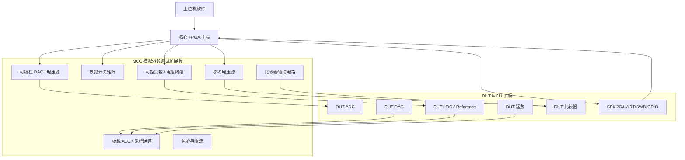

# MCU 模拟外设测试方案

## 章节定位

本章定义平台如何支持 MCU 和混合信号芯片中常见模拟外设的研发级功能验证。

重点强调：

> 第一版目标不是替代高精度模拟测试仪或 ATE，而是完成 MCU 模拟外设的自动化功能验证、边界检查、回归测试和问题复现。

## 方案核心

MCU 模拟外设测试采用“核心 FPGA 主板 + 模拟外设测试扩展板 + DUT 子板”的方式实现。

```text
上位机
  ↓ 配置测试计划
核心 FPGA 主板
  ↓ 数字控制 / 协议读写 / Pattern / Capture
MCU 模拟外设测试扩展板
  ↓ DAC / ADC / 比较器阈值 / 负载 / 模拟开关
DUT MCU
  ↓ 外设响应
上位机回读寄存器 / 波形 / 电压电流并判定
```

核心思想：

- 模拟激励由扩展板提供
- 数字控制由 FPGA 提供
- DUT 内部结果通过寄存器、GPIO、比较输出或 ADC 数据读回
- 上位机统一记录输入条件、输出结果和判定范围

## 测试边界

### 第一版主打

- ADC 功能验证
- DAC 功能验证
- 比较器阈值验证
- 运放基础功能验证
- LDO / 基准源基础验证
- 温度、电压、电流的粗略监测
- 自动化回归和报告

### 第一版不主打

- 高精度 INL/DNL 全参数测试
- ppm 级基准源测量
- 高带宽运放频响测试
- 高精度噪声谱测试
- 大规模温度扫描
- 专业量产校准

这些能力可以预留仪器接口，但不作为 MVP 的核心目标。

## 总体硬件结构



## 可测模块

## ADC

### 测试目标

验证 DUT ADC 是否能在不同输入电压下输出合理数字码值。

第一版关注：

- 通道连通性
- 码值单调性
- 粗略增益/偏移
- 采样触发
- 多通道切换
- 电源/参考变化下的响应

### 测试方法

```text
扩展板 DAC 输出已知电压
  ↓
模拟开关接入 DUT ADC 通道
  ↓
DUT 启动 ADC 转换
  ↓
上位机通过 SPI/I2C/UART/SWD 读回 ADC 码值
  ↓
与期望范围比较
```

### 推荐测试项

| 测试项 | 方法 | 判定 |
|---|---|---|
| 零点测试 | 输入 0V 或接地 | 码值接近 0 |
| 满量程测试 | 输入接近 Vref | 码值接近满量程 |
| 中点测试 | 输入 Vref/2 | 码值接近中间值 |
| 多点扫描 | 0~Vref 分段输入 | 码值单调 |
| 通道切换 | 多 ADC 通道轮询 | 无明显串扰/错通道 |
| 触发测试 | 外部 Trigger 启动采样 | 采样时序符合预期 |

### 注意事项

- DAC 精度要高于目标功能验证需求
- 输入源阻抗要符合 DUT ADC 要求
- 多通道切换要考虑采样保持电容充电时间
- 第一版不要承诺完整 INL/DNL 参数

## DAC

### 测试目标

验证 DUT DAC 输出是否随配置码值变化，并在允许误差内。

### 测试方法

```text
上位机写 DUT DAC 码值
  ↓
DUT DAC 输出模拟电压
  ↓
扩展板 ADC 采样
  ↓
上位机读取并判定
```

### 推荐测试项

| 测试项 | 方法 | 判定 |
|---|---|---|
| 低码值输出 | 写 0 或接近 0 | 输出接近下限 |
| 中码值输出 | 写半量程 | 输出接近中点 |
| 高码值输出 | 写满量程 | 输出接近上限 |
| 阶梯扫描 | 多点码值输出 | 输出单调 |
| 负载能力 | 加轻载/中载 | 电压变化在范围内 |
| 更新触发 | 软件/硬件触发更新 | 输出变化时序正确 |

### 注意事项

- 扩展板 ADC 分辨率和精度要覆盖研发级判定
- 需要校准扩展板自身误差
- 对高精度 DAC 参数只做趋势和功能验证，不做量产保证

## 比较器

### 测试目标

验证 DUT 比较器在不同输入和阈值下翻转是否正确。

### 测试方法

```text
DAC1 输出比较器正端输入
DAC2 或参考源输出负端阈值
  ↓
DUT 比较器输出到 GPIO / 中断 / 寄存器
  ↓
FPGA Capture 或协议读回
  ↓
判断翻转点和状态
```

### 推荐测试项

- 固定阈值下输入扫描
- 固定输入下阈值扫描
- 上升沿/下降沿滞回检查
- 中断触发验证
- 输出极性配置验证
- 低功耗模式唤醒验证

### 判定方式

第一版可以用阈值窗口判定：

```text
预期翻转电压 ± 允许误差窗口
```

不追求精密 offset 测试。

## 运放

### 测试目标

验证 DUT 内部运放的基本连通性、增益配置和输出范围。

### 常见配置

- 缓冲器
- 同相放大
- 反相放大
- PGA 可编程增益
- 比较器前级缓冲

### 测试方法

```text
扩展板 DAC 输入已知电压
  ↓
DUT 运放按配置放大/缓冲
  ↓
扩展板 ADC 采样输出
  ↓
上位机判断输出是否在预期范围
```

### 推荐测试项

- unity gain 缓冲
- 多档增益配置
- 输出上下限
- 输入共模范围粗测
- 输出随输入单调变化
- 低功耗/使能控制

### 注意事项

- 不做高频带宽和相位裕度测试
- 不做噪声谱测试
- 不做精密失调电压参数保证

## LDO / 基准源

### 测试目标

验证 DUT 内部 LDO 或参考源是否能正常输出，负载变化下是否保持基本稳定。

### 测试方法

```text
DUT 打开 LDO / Reference
  ↓
扩展板 ADC 测量输出电压
  ↓
可控负载切换
  ↓
再次测量电压和状态位
  ↓
判定是否在范围内
```

### 推荐测试项

- 空载输出电压
- 轻载输出电压
- 中载输出电压
- 使能/关闭控制
- PGOOD / 状态位
- 异常负载保护

### 注意事项

- 可控负载要有限流和热设计
- 对 LDO 纹波、瞬态响应只做预留，不作为 MVP 主项

## 模拟开关矩阵

为了减少人工接线，扩展板应包含模拟开关矩阵。

用途：

- DAC 输出切到不同 DUT ADC 通道
- DUT DAC 输出切到板载 ADC
- 参考源切到比较器输入
- LDO 输出切到负载和测量通道

设计要求：

- 导通电阻和漏电满足研发级测试需求
- 通道默认断开
- 上电默认安全状态
- 切换动作受上位机配置和安全规则限制

## 校准与误差管理

即使第一版不做高精度参数测试，也需要基本校准。

建议记录：

- 板载 DAC 实际输出校准表
- 板载 ADC 增益/偏移
- 参考源实际值
- 电阻网络实际值
- 通道开关引入误差
- 测试温度

上位机报告中应区分：

```text
DUT 测量结果
扩展板测量误差
判定容差
```

避免把扩展板误差误判为 DUT 问题。

## 软件测试流程

典型测试流程：

```text
加载 DUT 配置
  ↓
识别模拟扩展板
  ↓
加载校准数据
  ↓
检查电压范围和通道映射
  ↓
DUT 上电
  ↓
初始化 DUT 寄存器
  ↓
配置模拟激励
  ↓
执行 ADC/DAC/比较器/运放/LDO 测试
  ↓
采集结果
  ↓
判定 PASS/FAIL
  ↓
保存原始数据和报告
```

## 配置文件建议

示例：

```yaml
dut:
  name: demo_mcu
  vref: 3.3

adc_tests:
  - channel: adc0
    source: dac0
    points: [0.0, 0.5, 1.0, 1.65, 2.5, 3.0]
    tolerance_lsb: 20

dac_tests:
  - channel: dac0
    measure: ext_adc0
    codes: [0, 512, 1024, 2048, 3072, 4095]
    tolerance_mv: 30

comparator_tests:
  - pos: dac0
    neg: dac1
    sweep_mv: [500, 1000, 1500, 2000]
    tolerance_mv: 50
```

## 关键工程问题

必须提前处理：

- 模拟地和数字地规划
- DUT 参考电压来源
- 扩展板 ADC/DAC 精度等级
- 模拟开关漏电和导通电阻
- 输入保护和过压保护
- DUT 引脚误接保护
- 校准流程
- 测试夹具接触电阻
- 多通道串扰
- 温漂影响

## MVP 建议

第一版 MCU 模拟外设测试扩展板建议实现：

- 4 路可编程 DAC / 电压源
- 4~8 路板载 ADC 采样
- 1 组模拟开关矩阵
- 2~4 档可控负载
- 1~2 路参考源
- 比较器阈值测试通道
- DUT 电源电压/电流监控
- 与核心板 SPI/I2C/GPIO 控制接口
- 板载 EEPROM 存储 ID 和校准数据

## 价值总结

MCU 模拟外设测试方案的价值在于：

- 让 MCU 外设验证从手动测量变成自动流程
- 让 ADC/DAC/比较器/运放/LDO 的功能问题更容易复现
- 让模拟测试结果进入统一报告和历史数据库
- 为后续 AI 分析和补充测试提供结构化数据

第一版只要把“研发级功能验证闭环”做扎实，就已经能明显提升 MCU 和混合信号芯片验证效率。
