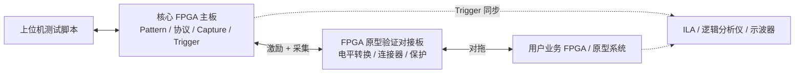

# 流片前 FPGA 原型验证方案

## 章节定位

本章定义平台如何进入流片前验证阶段，用核心 FPGA 主板替代或增强现有单片机对拖测试，为业务 FPGA / 原型板提供外部可控环境。

目标不是取代仿真和 FPGA 原型系统，而是补足外部激励、协议仿真、异常注入、信号观测和自动化回归能力。

## 目标

流片前 FPGA 原型验证模式要实现：

```text
核心 FPGA 主板作为外部世界
  ↓
给业务 FPGA / 原型系统提供协议输入、Pattern 输入、异常输入
  ↓
采集业务 FPGA 输出和内部观测点
  ↓
自动判断行为是否符合预期
  ↓
形成可回归、可复现、可延续到流片后的测试资产
```

核心价值：

- 提前暴露流片后才容易出现的问题
- 增强单片机对拖无法覆盖的并行和时序场景
- 把原型验证脚本延续到流片后芯片测试
- 为 AI 自动生成/分析测试用例提供数据入口

## 现有方式：单片机对拖测试

很多项目在流片前会用单片机和 FPGA 原型板对拖。

典型方式：

```text
单片机模拟外设或主机
  ↓ SPI/I2C/UART/GPIO
业务 FPGA / 原型系统
  ↓ 响应状态
单片机读回并判断
```

### 优点

- 成本低
- 开发门槛低
- 软件灵活
- 适合低速协议验证
- 适合简单寄存器读写和状态轮询

### 局限

- 并行 IO 数量有限
- 时序精度有限
- 多信号同步能力弱
- 难做复杂 Pattern
- 难做高速 Capture
- 难做精确异常注入
- 长时间回归日志能力弱
- 与流片后芯片测试平台割裂

## 新增方向：核心板对拖 FPGA 原型验证

平台新增一类工作模式：核心 FPGA 主板作为业务 FPGA 的外部可控环境。



核心板可承担：

- 主机接口模拟
- 外设接口模拟
- 多路 GPIO/并行总线激励
- 异常输入注入
- Trigger 同步
- 响应 Capture
- 长时间回归执行

## 与单片机对拖的关系

不是完全替代，而是分层使用。

| 场景 | 单片机对拖 | 核心 FPGA 对拖 |
|---|---|---|
| 简单低速寄存器读写 | 适合 | 也可支持 |
| 低成本快速调试 | 适合 | 成本较高 |
| 多 IO 并行 Pattern | 不适合 | 适合 |
| 精确边界时序 | 不适合 | 适合 |
| 异常协议注入 | 较弱 | 强 |
| 长时间 Capture | 较弱 | 强 |
| 与流片后测试复用 | 弱 | 强 |

推荐策略：

- 简单 bring-up 和低速调试仍可用单片机
- 关键功能、异常场景、回归测试使用核心 FPGA 平台
- 两者的测试用例尽量在上位机层统一描述

## 核心能力

### 1. 协议对拖

核心 FPGA 模拟主机或外设，与业务 FPGA 进行协议交互。

支持方向：

- SPI Master / Slave
- I2C Master / Slave
- UART
- GPIO
- PWM / Capture
- 简单并行总线
- 自定义握手总线

典型场景：

```text
核心板模拟 MCU 主机 → 配置业务 FPGA 寄存器
核心板模拟外设 → 响应业务 FPGA 访问
核心板模拟异常外设 → 返回错误状态或超时
```

### 2. Pattern 对拖

Pattern 用于描述多 IO 同步输入输出。

典型用途：

- 并行数据输入
- 多信号同步边界测试
- Reset / Boot Mode 组合
- 片选、时钟、数据线异常组合
- 边界时序扫描

Pattern 对拖比普通协议控制更适合做：

- 时序边界
- 异常激励
- 高并行输入
- 重复回归向量

### 3. 异常注入

异常注入是核心 FPGA 对拖模式的重要优势。

可注入异常：

- 协议超时
- ACK/NACK 错误
- 半包数据
- CRC 错误
- 位翻转
- 毛刺
- Reset 抖动
- 时钟暂停
- 数据乱序
- 电源状态变化配合输入异常

异常注入应可配置、可复现、可记录。

### 4. 信号观测

核心 FPGA 不仅提供激励，还要采集响应。

可观测对象：

- 业务 FPGA 输出 IO
- 协议响应
- 错误状态线
- 中断线
- Ready/Valid 握手
- Trigger 信号
- 关键 Debug Pin

对于业务 FPGA 内部信号，可通过：

- ILA
- Debug bus
- 导出观测点到对接板
- 寄存器状态 dump

与核心板 Capture 结果关联。

### 5. 自动回归

上位机可把原型验证用例组织成回归集：

```text
正常协议用例
边界输入用例
异常注入用例
长时间稳定性用例
历史失败复现用例
```

每次 RTL 更新或 FPGA bitstream 更新后自动执行。

## 硬件接口建议

### 对拖接口

建议 FPGA 原型验证对接板至少支持：

- 64~128 路通用数字 IO
- 多组 SPI/I2C/UART/GPIO
- Trigger In/Out
- Clock In/Out
- Reset 控制
- 电平转换
- ESD 保护
- 可选差分信号
- 板卡 ID

### 连接方式

常见连接方式：

| 方式 | 适合场景 | 说明 |
|---|---|---|
| 排针/排母 | 低速、早期调试 | 成本低但可靠性一般 |
| FMC 类连接器 | FPGA 板互联 | 成熟、信号较多 |
| 板对板连接器 | 自研系统 | 机械可靠性好 |
| 线缆连接 | 客户现场复现 | 灵活但信号完整性较弱 |

### 电平与保护

业务 FPGA 可能使用不同 IO 电压。

对接板需要处理：

- 1.8V / 2.5V / 3.3V 电平转换
- IO 方向控制
- 默认高阻
- 上电顺序
- 反灌保护
- 误接保护

### 时钟与同步

建议支持：

- 核心板输出参考时钟给业务 FPGA
- 业务 FPGA 输出时钟给核心板采样
- 外部仪器 Trigger 同步
- 多板同步预留

## 软件与验证流程

### 标准流程

```text
选择原型项目
  ↓
加载业务 FPGA 配置描述
  ↓
识别对接板
  ↓
检查 IO 电压和方向
  ↓
下载或选择测试用例
  ↓
配置协议控制器 / Pattern / Capture
  ↓
同步 Reset 和时钟
  ↓
执行正常用例
  ↓
执行异常用例
  ↓
保存 Capture 和日志
  ↓
生成回归报告
```

### 用例配置示例

```yaml
prototype:
  name: demo_fpga_proto
  clock: 50MHz
  reset: active_low

interfaces:
  spi0:
    role: master
    mode: 0
    freq: 10MHz
  gpio_bus0:
    width: 32

cases:
  - name: normal_register_access
    steps:
      - spi_write: {addr: 0x00, data: 0x01}
      - spi_read: {addr: 0x04, expect: 0x55}

  - name: nack_injection
    steps:
      - inject_spi_error: {type: nack, at_byte: 2}
      - expect_gpio: {signal: error_flag, value: 1}
```

## 与流片后测试的衔接

流片前用例要尽量设计成流片后可复用。

示例：

| 流片前对象 | 流片后对象 | 可复用内容 |
|---|---|---|
| 业务 FPGA 寄存器 | 芯片寄存器 | 读写序列、预期值 |
| FPGA IO | DUT IO | Pattern、Capture 条件 |
| 原型错误状态 | 芯片状态寄存器 | 错误判定逻辑 |
| 异常注入 | 芯片鲁棒性测试 | 异常场景描述 |
| 回归报告 | bring-up 报告 | 用例结果结构 |

这样平台从流片前就开始沉淀测试资产。

## 对产品定位的影响

加入 FPGA 原型验证模式后，平台定位从“流片后测试工具”升级为：

> 贯穿芯片研发前后端的验证平台。

这有几个重要意义：

- 更早进入项目流程
- 不等样片回来才开始建设测试用例
- 流片前问题可通过平台提前暴露
- 流片后 bring-up 可以复用已有验证资产
- 客户现场问题可以回灌到原型验证和回归库

## 第一阶段实现建议

MVP 阶段不要做过复杂的原型验证系统。

建议先做一个 Demo 闭环：

```text
核心板 SPI Master
  ↓
对接板电平转换
  ↓
业务 FPGA SPI Slave Demo
  ↓
核心板注入正常读写和异常时序
  ↓
Capture 错误标志和响应波形
  ↓
上位机生成报告
```

第一阶段重点：

- 32~64 路对拖 IO
- SPI/I2C/UART/GPIO 基础对拖
- Trigger 同步
- Reset 控制
- 异常注入 2~3 类
- Capture 失败窗口
- 回归报告

第二阶段再扩展：

- 更多 IO
- 并行总线
- 多时钟域
- 多板同步
- 更复杂协议
- 与 ILA/外部仪器联动

## 风险与注意事项

- 业务 FPGA 接口差异大，需要配置文件抽象
- 不同 FPGA 板 IO 电压不同，必须做安全检查
- 高速接口不适合第一版强行覆盖
- Pattern 和协议控制器边界要清晰
- Capture 数据量可能很大，需要 DDR 和筛选机制
- 原型验证用例如果没有规范管理，很容易再次变成临时脚本

## 价值总结

流片前 FPGA 原型验证方案让平台价值前移：

```text
不是等芯片回来才测试，
而是在流片前就开始构建可复用的验证资产。
```

它把单片机对拖、FPGA 原型、流片后测试、回归测试和问题复现统一到同一套平台思路里，是本项目区别于普通芯片测试板的重要战略方向。
