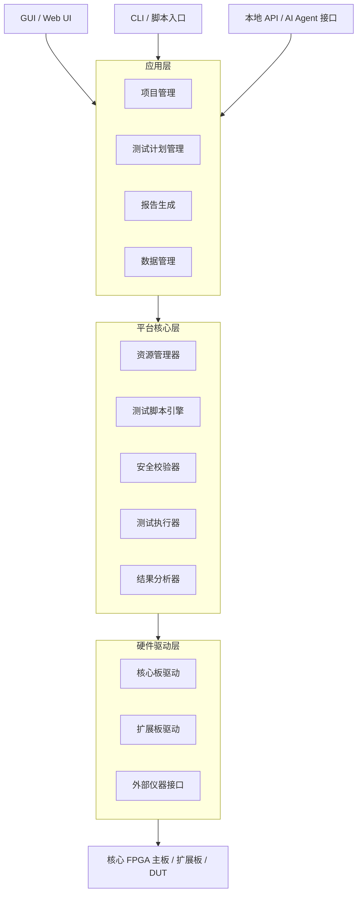

# 上位机软件设计

## 章节定位

上位机软件是整个平台的大脑。

硬件提供资源，上位机负责把资源组织成可配置、可执行、可记录、可复现的测试流程。

上位机不只是一个 GUI 控制面板，而应逐步演进为：

```text
资源管理器
测试脚本引擎
数据采集系统
报告生成系统
回归测试平台
AI 自动化接口
```

## 软件目标

第一版上位机目标：

- 识别核心板和扩展板
- 加载配置文件
- 管理 IO、电源、时钟、Trigger、Pattern、Capture、协议资源
- 执行测试脚本
- 实时显示状态
- 保存测试日志和数据
- 自动生成测试报告
- 提供后续 AI 接口

长期目标：

- 多 DUT 项目管理
- 测试用例库
- 历史数据分析
- 回归测试调度
- 外部仪器联动
- 客户现场复现包
- AI 生成测试计划和失败分析

## 总体软件架构



## 功能模块

### 1. 项目管理

项目管理负责组织不同 DUT、扩展板、测试计划和历史结果。

建议目录结构：

```text
projects/
  demo_chip/
    dut.yaml
    test_plans/
    patterns/
    reports/
    captures/
    logs/
```

项目应记录：

- DUT 名称和版本
- 封装
- 引脚映射
- 电源需求
- 扩展板型号
- 测试计划版本
- 历史测试结果

### 2. 资源配置

资源配置是上位机核心。

统一管理：

- 数字 IO
- 电源
- 时钟
- Trigger
- Pattern 通道
- Capture 通道
- 协议控制器
- 模拟资源
- 扩展板资源

示例资源名：

```text
io.bank_a.ch0
power.dut_vdd
clock.dut_ref
trigger.in0
spi0
capture.group0
analog.dac0
```

上位机负责把逻辑资源映射到硬件资源。

### 3. 安全校验器

安全校验必须在测试执行前完成。

检查项：

- 是否识别核心板
- 是否识别扩展板
- DUT 配置是否加载
- IO 电压域是否匹配
- IO 方向是否冲突
- DUT 电源电压是否在范围内
- 电流限制是否设置
- 电平转换 OE 是否安全
- Pattern 是否会驱动禁止引脚
- Capture 是否绑定有效通道

不通过安全校验，禁止执行测试。

### 4. 测试脚本引擎

测试脚本引擎负责把测试计划转成硬件动作。

基础动作：

- power_on / power_off
- set_voltage / set_current_limit
- set_gpio
- spi_write / spi_read
- i2c_write / i2c_read
- uart_send / uart_expect
- load_pattern
- run_pattern
- start_capture
- wait_trigger
- assert_equal / assert_range
- save_capture

脚本可以先采用 YAML/JSON 描述，后续支持 Python API。

### 5. Pattern 管理

Pattern 管理包括：

- Pattern 文件导入
- Pattern 编译
- Pattern 下载
- Pattern 版本管理
- Pattern 与 DUT 引脚映射
- Pattern 执行结果关联

第一版可以从 CSV/YAML Pattern 开始。

### 6. Capture 管理

Capture 管理包括：

- Capture 条件配置
- Trigger 前后窗口
- Capture 数据回读
- 波形展示
- 失败通道定位
- 导出 VCD/CSV
- 与测试报告关联

### 7. 数据展示

GUI 至少应展示：

- 连接状态
- 核心板状态
- 扩展板状态
- DUT 电源状态
- 当前测试进度
- PASS/FAIL 结果
- 错误日志
- Capture 波形简图
- 电压电流趋势

### 8. 报告生成

报告应包含：

- 项目信息
- DUT 信息
- 核心板/扩展板版本
- 测试计划版本
- 测试时间
- 测试环境
- 每个测试项结果
- 失败详情
- Capture 附件
- 原始日志路径
- 结论

报告格式：

- HTML
- PDF
- Markdown
- JSON 原始数据

### 9. 数据管理

测试数据需要结构化保存。

建议保存：

```text
runs/
  2026-xx-xx_测试批次/
    run.json
    log.txt
    report.md
    capture_001.vcd
    power_trace.csv
```

关键字段：

- run_id
- dut_id
- board_id
- extension_id
- test_plan_version
- firmware_version
- result
- fail_items
- artifacts

### 10. AI 接口

AI 不直接控制硬件底层，而是通过受控 API 操作。

AI 可调用能力：

- 查询 DUT 配置
- 生成测试计划草稿
- 解释失败日志
- 读取 Capture 摘要
- 推荐补充测试
- 生成报告说明

AI 操作必须经过：

```text
AI 建议 → 上位机安全校验 → 用户/规则授权 → 硬件执行
```

> ⚠️ 高风险动作强制人工放行：[[14-配置文件Schema规范]] 的 C1~C10 是**机器校验**，能挡住"违规"用例，但挡不住"合规却不合理"的用例（如反复极限上电、长时间满载压力、电源逼近上限）。因此"授权"环节须分级：
>
> ```text
> 低风险（只读、常规读写、范围内电压）：规则自动放行
> 高风险（电源极限、长时间压力、异常注入到 DUT、首次对新 DUT 上电）：强制人工二次确认
> ```
>
> AI 生成的 test_plan 不得自动执行高风险动作——这是 [[02-总体系统架构]]/[[09-风险与边界]]"软件不能绕过安全"原则在 AI 闭环中的延伸。

## 配置文件体系

### core_board.yaml

描述核心板固定资源。

```yaml
core_board:
  model: core_fpga_v1
  fpga: TBD
  io_groups:
    - name: bank_a
      channels: 32
      voltage: configurable
  ddr:
    size_mb: 512
  protocols: [spi0, i2c0, uart0, gpio]
```

### extension_board.yaml

描述扩展板能力。

```yaml
extension_board:
  model: digital_adapter_v1
  id: 0x1001
  io_mapping:
    bank_a.ch0: dut.pin1
  power_channels:
    - name: dut_vdd
      range: [1.2, 5.0]
      current_limit: 0.5
```

### dut.yaml

描述 DUT。

```yaml
dut:
  name: demo_chip
  package: BGA256
  power:
    - name: vdd
      voltage: 3.3
      max_current: 0.2
  pins:
    - name: SPI_CLK
      type: input
      voltage: 3.3
```

### test_plan.yaml

描述测试流程。

```yaml
test_plan:
  name: smoke_test
  steps:
    - power_on: dut_vdd
    - spi_write: {bus: spi0, addr: 0x00, data: 0x01}
    - spi_read: {bus: spi0, addr: 0x04, expect: 0x55}
    - run_pattern: basic_io_test
```

## GUI 设计建议

第一版 GUI 不必复杂，但要围绕测试流程组织。

建议页面：

1. 设备连接页
2. 项目/DUT 选择页
3. 资源映射页
4. 电源控制页
5. 测试计划页
6. 执行监控页
7. Capture 查看页
8. 报告页
9. 配置文件编辑页
10. 日志/调试页

## CLI 设计建议

CLI 便于自动化和回归。

示例命令：

```bash
fpga-test list-boards
fpga-test load-project demo_chip
fpga-test check-safety
fpga-test run smoke_test
fpga-test report latest
fpga-test capture export latest --format vcd
```

## 推荐技术路线

### 第一版建议

根据快速落地原则：

- 后端：Python
- GUI：PyQt / Web UI 二选一
- 配置：YAML
- 数据：SQLite + 文件目录
- 报告：Markdown/HTML → PDF
- 波形：CSV/VCD 导出，GUI 简单查看
- 硬件通信：USB/Ethernet 驱动封装为 Python API

### 为什么推荐 Python

- 快速开发
- 适合测试自动化
- 易接仪器库
- 易生成报告
- 易接 AI Agent
- 适合研发阶段频繁迭代

后续如果需要产品化，可把底层通信和高性能部分用 C/C++/Rust 实现，上层继续用 Python/GUI 调度。

## MVP 软件交付物

第一版软件至少交付：

- 设备连接和识别
- 配置文件加载
- 安全检查
- 电源控制
- SPI/I2C/UART/GPIO 基础控制
- Pattern 下载和执行
- Capture 回读
- 测试计划执行
- 日志保存
- 报告生成
- Demo 项目模板

## 软件验收标准

MVP 软件验收应看闭环：

- 能识别核心板和扩展板
- 能加载 DUT 配置
- 能阻止危险配置
- 能执行一套完整测试计划
- 能保存原始日志和 Capture
- 能生成可读报告
- 同一测试可重复执行并结果一致
- 换 DUT 配置时不需要改底层代码

## 长期演进

长期上位机可发展为：

- 多项目测试管理平台
- 测试用例库
- Pattern 编译器
- Capture 波形分析器
- 仪器联动控制器
- AI 测试助手
- 客户现场复现包生成器
- 数据看板
- 云端/局域网协同执行

## 当前结论

上位机软件是平台能否成为“平台”的关键。

如果只有硬件，没有上位机资源抽象、脚本执行、数据管理和报告闭环，就仍然只是开发板或测试板。

第一版应优先保证：

```text
配置可管理
执行可重复
数据可追踪
失败可复现
报告可输出
安全可兜底
```
